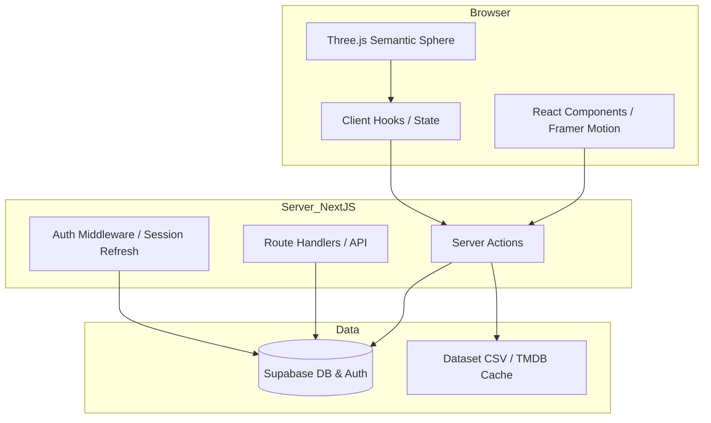

# Architettura Generale

[← Torna all'indice](./progetto.md)

## Visione d'Insieme
NoZapp adotta un'architettura **Full-stack moderna** basata su **Next.js 14** con l'utilizzo estensivo di **App Router**. Il progetto è strutturato per separare nettamente la visualizzazione 3D ad alte prestazioni dalla gestione dei dati e dell'autenticazione.

### Layer Architetturali
1. **UI Layer (Interaction)**: Composto da componenti React (Shadcn UI) e dal motore 3D (Three.js). Gestisce l'input utente e il feedback visivo.
2. **Logic Layer (Orchestration)**: Gestito tramite **Server Actions** e **Custom Hooks**. Include la logica di attraversamento del grafo semantico (`traversal.ts`).
3. **Data Layer (Persistence)**: Alimentato da **Supabase** (PostgreSQL) per i dati dinamici e da un **Dataset CSV** statico arricchito per la base di conoscenza dei film.

## Scelte Tecniche Chiave

### Next.js App Router
L'utilizzo dell'App Router permette una gestione granulare del **Server-Side Rendering (SSR)** e del **Client-Side Rendering (CSR)**:
- **Pagine e Layout**: In gran parte Server Components per massimizzare le performance e la SEO.
- **Interattività 3D**: Il componente `SemanticSphere` è contrassegnato con `"use client"` poiché richiede l'accesso a `window`, `document` e al ciclo di vita del browser per il rendering WebGL.

### Rendering Strategico
| Componente | Strategia | Rationale |
| :--- | :--- | :--- |
| **Sphere Page** | dynamic (force-dynamic) | Necessita di dati personalizzati in base all'utente loggato. |
| **Onboarding** | force-dynamic | Gestisce stati di sessione e database in tempo reale. |
| **API Admin** | Route Handlers | Utilizzate per operazioni CRON e bypass delle RLS via Service Role. |

## Diagramma dei Layer

## Flusso Generale dei Dati
1. Il **Middleware** intercetta la richiesta e valida la sessione.
2. La **Server Page** recupera il profilo utente e i dati del grafo da Supabase/CSV.
3. Lo **Sphere Engine** riceve i dati iniziali come props e costruisce la scena 3D.
4. Ogni interazione (like/seen) attiva una **Server Action** che aggiorna Supabase in tempo reale.

## Sicurezza Multi-livello

NoZapp adotta un approccio a più livelli per proteggere i dati e le funzionalità amministrative:

1. **Role-Based Access Control (RBAC)**: Utilizzo del flag `is_admin` nella tabella `users` per distinguere gli amministratori.
2. **Row-Level Security (RLS)**: Le policy di Supabase garantiscono che solo gli admin possano modificare gli articoli (`articles`), mentre il pubblico può solo leggerli.
3. **Multi-Factor Authentication (MFA)**: Un secondo livello di verifica tramite OTP (One-Time Password) è richiesto per accedere a qualsiasi risorsa sotto il path `/admin`. La sessione MFA è gestita tramite cookie sicuri `httpOnly`.

---
> [!TIP]
> Il progetto utilizza un approccio "Defense-in-Depth" per la sicurezza, coordinando RLS su Supabase, MFA nel middleware e validazione Zod nelle API.

🔄 **Aggiornato il 2026-03-26**: Inserito il layer di sicurezza MFA per l'area amministrativa.
