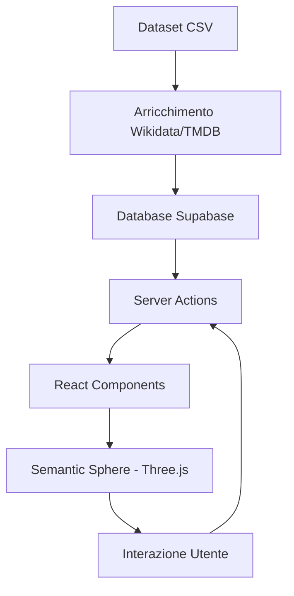

# Architettura Generale

NoZapp è strutturata seguendo i pattern moderni di **Next.js 14**, sfruttando l'App Router per una gestione granulare del rendering lato server e lato client.

## Layer Architetturali

L'applicazione è suddivisa in tre layer principali:

1.  **Backend & Data Layer (Supabase / File System)**:
    *   Dataset cinematografico memorizzato in Supabase.
    *   Pipeline di arricchimento dati tramite script Python che interrogano Wikidata e TMDB.
    *   Autenticazione gestita interamente tramite Supabase Auth.
2.  **Logic Layer (Server Actions & Custom Hooks)**:
    *   **Server Actions**: Gestiscono le interazioni (like, seen) e il recupero dei dati, garantendo sicurezza e performance.
    *   **Graph Engine**: Logica di attraversamento del grafo (`traversal.ts`) per determinare le connessioni tra i film.
    *   **Hooks**: Gestione dello stato client e interazioni Three.js.
3.  **UI & Visualization Layer (Three.js / React)**:
    *   **Sfera Semantica**: Cuore pulsante dell'app, realizzata con Three.js puro all'interno di un componente React.
    *   **UI Components**: Realizzati con Tailwind CSS e Radix UI per un'interfaccia premium e accessibile.

## Strategie di Visualizzazione (Shells)

I dati vengono visualizzati nella **Sfera Semantica** attraverso tre livelli di profondità chiamati "Shells":

*   **Shell 0 (Pilastri)**: I film fondamentali o di partenza scelti dall'utente o dal sistema.
*   **Shell 1 (Affinità)**: Film strettamente correlati ai pilastri per tema o stile.
*   **Shell 2 (Scoperta)**: Film più distanti ma suggeriti attraverso connessioni di contrasto.

## Diagramma della Struttura

## Scelte Architetturali Chiave

*   **App Router vs Pages Router**: Si è scelto l'App Router per sfruttare i Server Components e ridurre il bundle JavaScript inviato al client.
*   **Three.js lato Client**: La sfera 3D utilizza la direttiva `"use client"` poiché richiede l'accesso alle API del browser (DOM, WebGL, window events).
*   **Navigazione Ibrida**: L'header flottante (`Header.tsx`) gestisce la navigazione tra le sezioni della pagina Home, mentre lo `ShellNavigator` gestisce la navigazione all'interno del grafo 3D.

---
[← Torna all'indice](./index.md)
