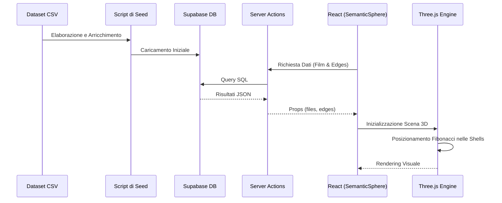

# Flusso dei Dati

Questa pagina descrive come i dati fluiscono dal dataset statico fino alla visualizzazione interattiva nella Sfera Semantica.

## Dall'Origine alla UI

## Gestione dello Stato

*   **Stato Globale**: Non viene utilizzata una libreria di state management pesante (come Redux). Si preferisce l'uso dei **Context API** di React dove necessario.
*   **Stato Client (Three.js)**: Gestito tramite `useRef` all'interno di `SemanticSphere.tsx` per evitare re-render eccessivi di React durante il loop di animazione a 60fps.
*   **Sincronizzazione Feedback**: Quando l'utente clicca su "Like", lo stato locale viene aggiornato immediatamente (Ottimismo) e inviato via Server Action a Supabase. Successivamente, la `revalidatePath` assicura che il dato sia coerente sul server.

## Navigazione nel Grafo

Il flusso di navigazione tra i film è gestito dalla logica in `src/lib/graph/traversal.ts`. Quando un film viene selezionato:
1. Viene calcolato il `NavContext`.
2. Vengono identificati i nodi vicini (Siblings, Children, Parent).
3. Vengono filtrati i nodi da visualizzare in base alla shell corrente.

---
[← Torna all'indice](./index.md)
