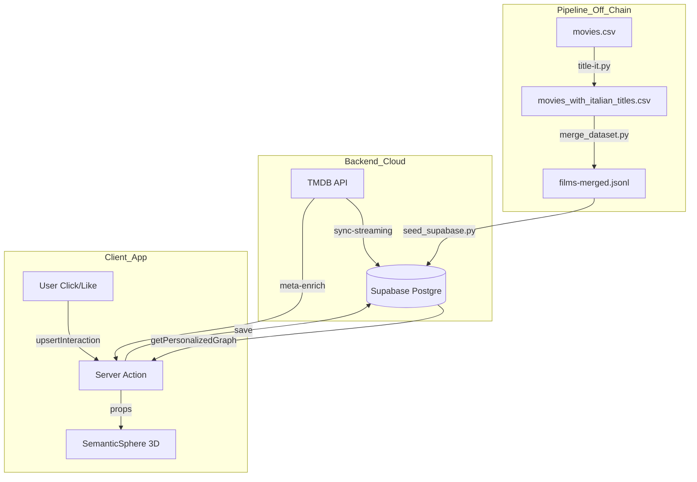

# Flusso dei Dati

[← Torna all'indice](./progetto.md)

## Panoramica del Flusso
Questa sezione descrive come i dati grezzi dei film entrano nel sistema, vengono trasformati e infine visualizzati nella **Sfera Semantica**.

## Ciclo di Vita del Dato
Il viaggio del dato cinematografico in NoZapp si articola in quattro fasi principali:

### 1. Ingestione (Raw Data)
I dati partono come file CSV nella cartella `dataset/`. Sono dati statici, spesso incompleti o solo in lingua inglese.

### 2. Trasformazione (Enrichment)
Gli script Python in `dataset/` e `scripts/`:
- Arricchiscono i titoli con Wikidata.
- Integrano i link ai poster e le informazioni sui generi.
- Filtrano i contenuti obsoleti o a basso rating.

### 3. Persistenza (Database)
I dati trasformati vengono caricati su **Supabase**.
- I metadati dei film (Tabella `films`) sono statici.
- Le interazioni utente (Like, Dislike, Feedback) sono dinamiche e generate in tempo reale.

### 4. Visualizzazione (Frontend 3D)
- Una **Server Action** interroga il database e recupera i nodi rilevanti per l'utente loggato.
- Il motore **Three.js** traduce questi dati in coordinate spaziali e relazioni visive (archi).

## Diagramma Mermaid del Flusso

## Gestione dello Stato Client
Il flusso dei dati lato client non utilizza Redux o Zustand; si affida invece a:
- **React State / Context**: Per lo stato della navigazione shell e dell'interfaccia di dettaglio.
- **Next.js Router**: Per gestire transizioni di pagina e parametri di ricerca.
- **Three.js Internal State**: Gli oggetti 3D (mesh) conservano i propri ID dei film per gestire raycasting e selezione.

---
> [!TIP]
> Il flusso dei dati è progettato per essere asincrono e non bloccante. Mentre la sfera carica i dati strutturali dal database, i poster e i metadati TMDB vengono recuperati on-demand per ottimizzare la banda.
