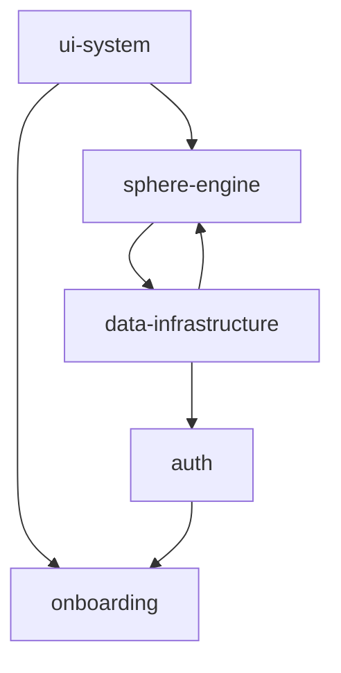

# NoZapp

## Panoramica
NoZapp è una web application moderna costruita con Next.js che integra una visualizzazione 3D avanzata (Three.js) per rappresentare grafi semantici. Utilizza Supabase per l'autenticazione e la persistenza dei dati, con un'interfaccia utente curata basata su Tailwind CSS e Framer Motion.

## Stack tecnologico
| Tecnologia | Versione | Ruolo |
| :--- | :--- | :--- |
| Next.js | ^16.1.6 | Framework Full-stack (App Router) |
| React | ^18 | Libreria UI |
| Supabase | ^2.98.0 | Backend-as-a-Service (Auth & DB) |
| Three.js | ^0.183.2 | Motore di rendering 3D |
| Tailwind CSS | ^3.4.1 | Styling e Design System |
| Framer Motion | ^12.38.0 | Animazioni e interazioni UI |
| TypeScript | ^5 | Linguaggio di programmazione |
| Vitest | ^4.0.18 | Testing Unitario |

## Macroaree identificate

### [[auth]]
**Tag**: #macroarea/auth
**Descrizione**: Gestione completa del ciclo di vita dell'utente (login, signup, sessioni) tramite Supabase SSR.
**File coinvolti**: `src/app/(auth)`, `src/app/auth`, `src/lib/auth-utils.ts`, `src/components/auth`
**Dipende da**: [[data-infrastructure]]

### [[sphere-engine]]
**Tag**: #macroarea/sphere-engine
**Descrizione**: Core engine per la visualizzazione 3D semantica, gestione del grafo e interazioni Three.js.
**File coinvolti**: `src/components/SemanticSphere.tsx`, `src/components/sphere.css`, `src/app/sphere/page.tsx`, `src/lib/graph/traversal.ts`
**Dipende da**: [[data-infrastructure]], [[ui-system]]

### [[onboarding]]
**Tag**: #macroarea/onboarding
**Descrizione**: Flusso guidato per l'inizializzazione del profilo utente e la configurazione iniziale.
**File coinvolti**: `src/app/onboarding`, `src/components/onboarding`
**Dipende da**: [[auth]], [[ui-system]]

### [[data-infrastructure]]
**Tag**: #macroarea/data-infrastructure
**Descrizione**: Strato di comunicazione con Supabase, gestione del rate limiting (Upstash), logging e utility globali.
**File coinvolti**: `src/lib/supabase`, `src/lib/rate-limit.ts`, `src/lib/logger.ts`, `src/lib/utils.ts`

### [[ui-system]]
**Tag**: #macroarea/ui-system
**Descrizione**: Componenti atomici (Shadcn/Radix), layout dell'applicazione (Shell Navigation) e stili globali.
**File coinvolti**: `src/components/ui`, `src/components/layout`, `src/app/globals.css`, `src/app/layout.tsx`

## Mappa dei collegamenti

## File da generare
- `docs/auth.md`
- `docs/sphere-engine.md`
- `docs/onboarding.md`
- `docs/data-infrastructure.md`
- `docs/ui-system.md`

---
✅ Relazione completata. Macroaree identificate: auth, sphere-engine, onboarding, data-infrastructure, ui-system. 
Puoi ora avviare l'Agente Scrittore con /scrittore.
