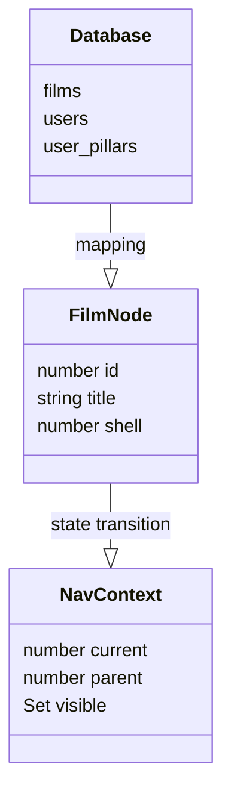

updated: 2026-03-31
agent: aggiornatore
---

# Tipi e Interfacce TypeScript

[← Torna all'indice](./progetto.md)

## Fondamenta
NoZapp è sviluppato interamente in TypeScript con tipizzazione rigorosa per garantire la stabilità del grafo e delle interazioni.

## Tipi Database (`src/types/supabase.ts`)
Generati automaticamente tramite Supabase CLI, definiscono lo schema esatto delle tabelle e dei JSON.

| Tabella | Tipo Principale | Descrizione |
| :--- | :--- | :--- |
| `films` | `Film` | Metadati statici del film (titolo, anno, ecc.). |
| `user_onboarding_results` | `OnboardingResult` | Configurazione JSON dei risultati del wizard. |
| `security_logs` | `SecurityLog` | Record degli audit di sicurezza. |
| `articles` | `Article` | Contenuti redazionali (titolo, slug, contenuto). |
| `cinema_movies` | `CinemaMovie` | Film in programmazione (manuali, con scadenza). |
| `users` | `User` | Profili utente estesi con flag `is_admin`, `onboarding_complete` e timestamp MFA (`admin_verified_at`). |

🔄 **Aggiornato il 2026-03-27**: Rimozione dei campi `role`, `phone_number`, `otp_code` e `otp_expires_at` dalla tabella `users` in favore di un sistema MFA via Email semplificato.

## Tipi del Grafo (`src/lib/graph/`)
Utilizzati dallo Sphere Engine per il rendering e la navigazione.

- **`FilmNode`**: Rappresenta un nodo nella sfera.
  - `id`: number
  - `title`: string
  - `shell`: 0 | 1 | 2
  - `geometry`: { x, y, z }
- **`FilmEdge`**: Rappresenta una relazione tra due film.
- **`NavContext`**: Lo stato della navigazione corrente.
  - `current`: ID film selezionato.
  - `parent`: ID film genitore nel percorso di navigazione.
  - `visible`: Set di ID film da renderizzare.

## Tipi Onboarding (`src/components/onboarding/types.ts`)
- **`OnboardingFilm`**: Estensione di `Film` con l'aggiunta di `onboarding_group` e campi colore personalizzati (`color_primary`, `color_accent`).
- **`ReactionType`**: `'loved' | 'disliked' | 'unseen' | 'seen' | null`.
- **`StreamingPlatform`**:
  - `id`: string
  - `name`: string
  - `logo?`: string (percorso all'asset SVG in `/public/logos`).

### Costanti
- **`STREAMING_PLATFORMS`**: Array tipizzato contenente l'elenco delle piattaforme supportate (Netflix, Prime Video, Disney+, ecc.) con i relativi loghi ufficiali.

---

## Relazioni tra Tipi

## Note su `any`
L'utilizzo del tipo `any` è scoraggiato e limitato esclusivamente a:
- Risposte da API esterne non ancora tipizzate (es. TMDB in fase di sviluppo rapido).
- Interfacce Three.js dove la tipizzazione nativa è troppo complessa (contrassegnato da `@ts-nocheck`).

---
> [!IMPORTANT]
> Quando modifichi lo schema del database su Supabase, ricordati di rigenerare i tipi tramite `npx supabase gen types typescript --project-id ... > src/types/supabase.ts`.

🔄 **Aggiornato il 2026-03-27**: Ripristinata la tabella `security_logs` nel database e nei tipi TypeScript.
🔄 **Aggiornato il 2026-03-31**: Spostamento dei tipi di onboarding in un file dedicato (`src/components/onboarding/types.ts`) e introduzione del tipo `StreamingPlatform` per la gestione dei loghi SVG.
